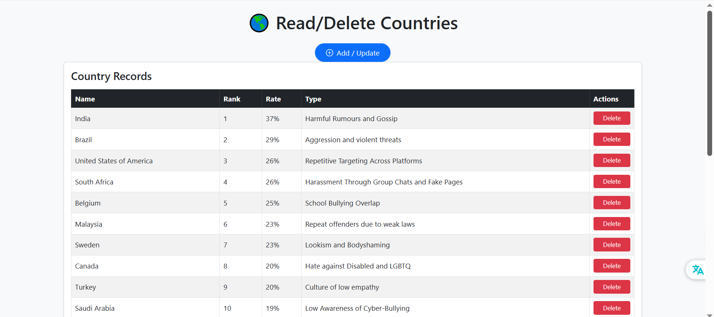
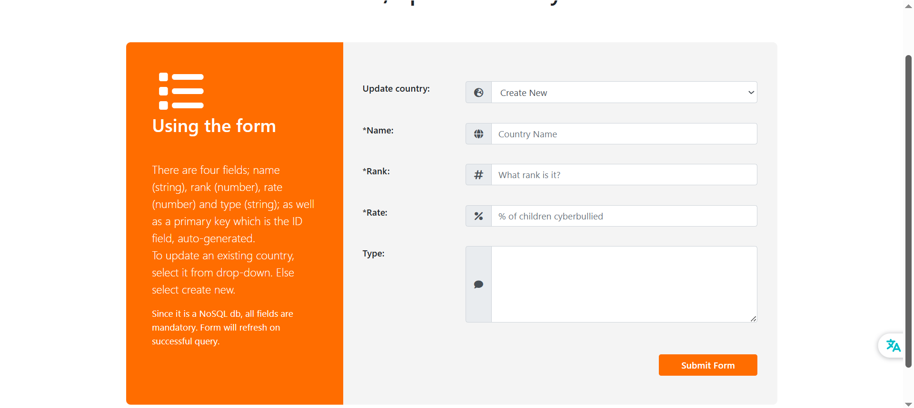
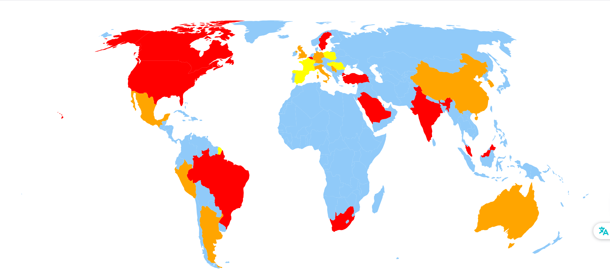
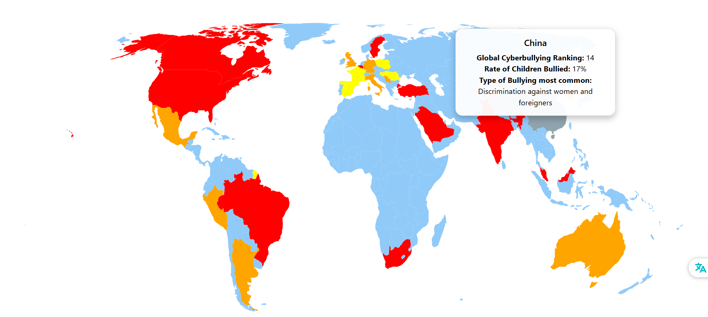
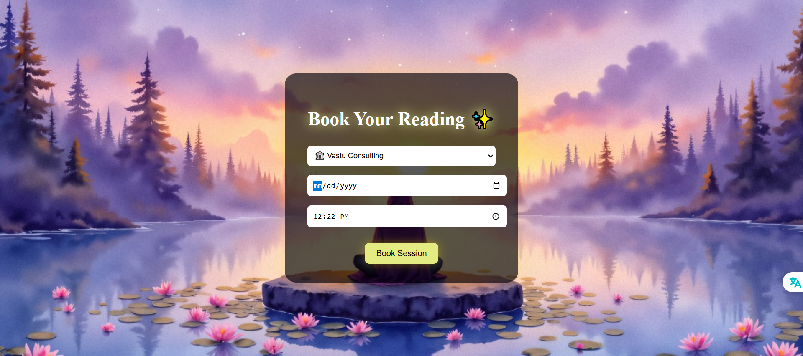
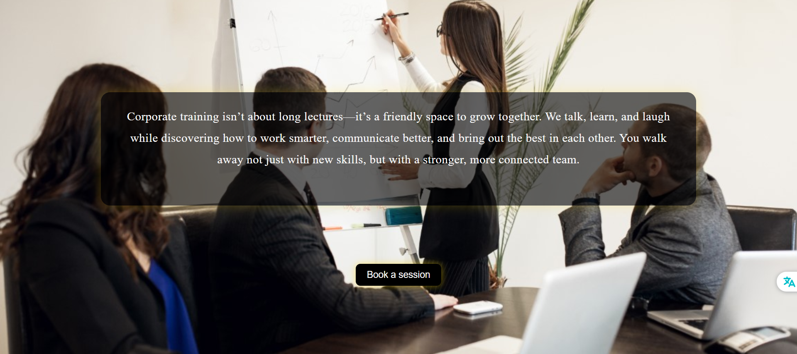

# Why I Chose Building for Businesses instead of the Leetcode Grind ⚙️🛡️  

During my internships, I noticed a disturbing pattern; small businesses were losing money and reputation to careless development. Some examples:

➡ A third-party dev deployed our site on an AWS server that was also being used as a command center by an Iranian APT group. The website was delivering malware to users and the domain was blacklisted on Spamhaus and every other major Spam List provider.

➡ The same dev shop took a fun, promising website and flattened it into a generic WordPress clone. The audience was primarily children; and no thought was placed for their experience and expression. The growth rate has understandbly been lukewarm since.

➡ I trained a government institution during a period of proxy cyber-war and found that even critical staff clicked every link and skipped MFA. All applications must be user-proofed; so as to maintain code and data hygiene, as well as security.

➡ A friend running a jewellery business used an app that had both bookings and inventory data within the same application. I provided his developer with some resources to set up canary tokens (cyber trip-alarms, as a metaphor) immediately—because inventory data comprises physical risk for him.

♜ Learning from the above, I kept my development process algorithmic: always reduce attack-surfaces as far as possible, utilize threat-models when required, and build from a research-backed user model. That’s why you never lose money using my work.

# 🚀 A Few Of My Recent Builds

### 🟩 Cyberbullying Map — An Interactive Map with CRUD functionality  
**Client:** Compudon Junior

**Summary:** An interactive map that pulls data from a NoSQL db and a separate CRUD desktop application that allows non-technical staff to update data year after year without any developer involvement.

**Tech:** React, Node, Firestore

**Deep Dive:** Medium link (will be published soon)

**Screenshots:**  
  
 

---

### 🎨 Portfolio Website — For a spiritual and motivational healer  
**Client:** Rina Shah  

**Summary:** To optimize beauty of the website as well as reduce risks; the website leans on "whitespace" with beautified images, optimized and modified for faster load times. 

**Tech:** React, Node

**Deep Dive:** Medium link (will be published soon)

**Screenshots:**  
 

# 📬 Contact  
Whether you want to get something built, or just want me to take a look at how to improve and secure an existing application:

**Email:** udit@uditrai.com  
**Book a Call:** <Calendly>  

<!---

### 🔒 <Project Name> — Custom Portfolio Site  
**Client Type:** Individual  
**Goal:** <Brand, presence, visibility>  
**Solution:** <Design system, CMS, animations, performance>  
**Outcome:** <More leads, strong presence>  
**Tech:** <Stack>  
**Screenshots:**  

---

# 🧩 How I Work  
**Fast. Transparent. Secure.**  
- Fixed-scope pricing  
- Milestone-based delivery  
- Weekly updates  
- Documented code  
- Scalable, maintainable architecture  
- Security-first mindset by default  

I don’t just build what you ask for.  
I build what you actually **need** for long-term stability.

--->
*Tell me what you want — I’ll build the safest, cleanest version of it.*

